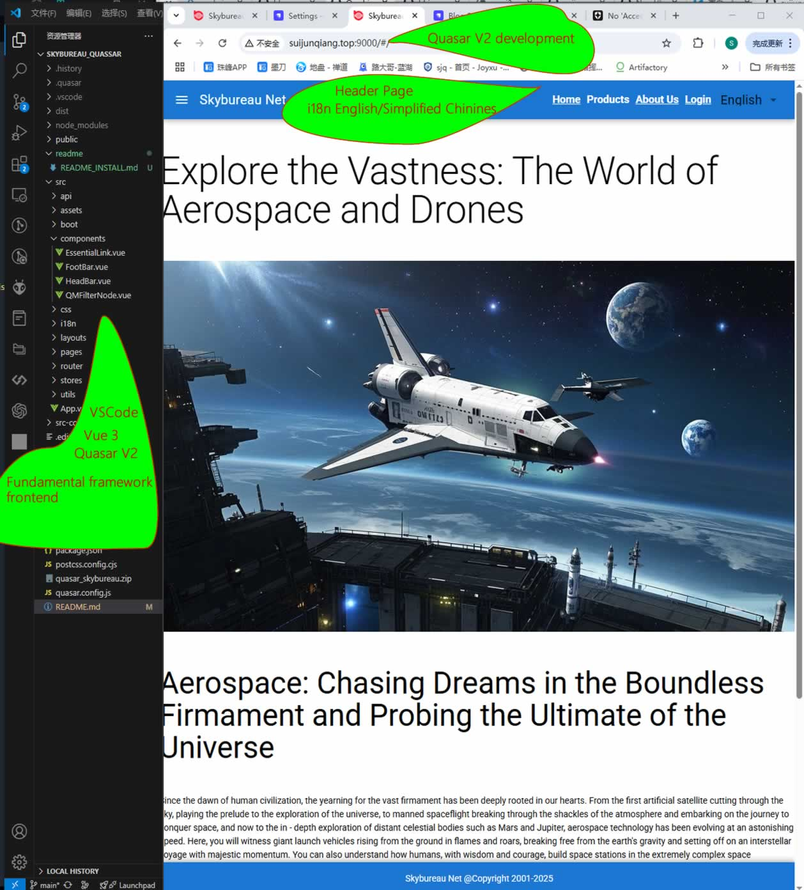
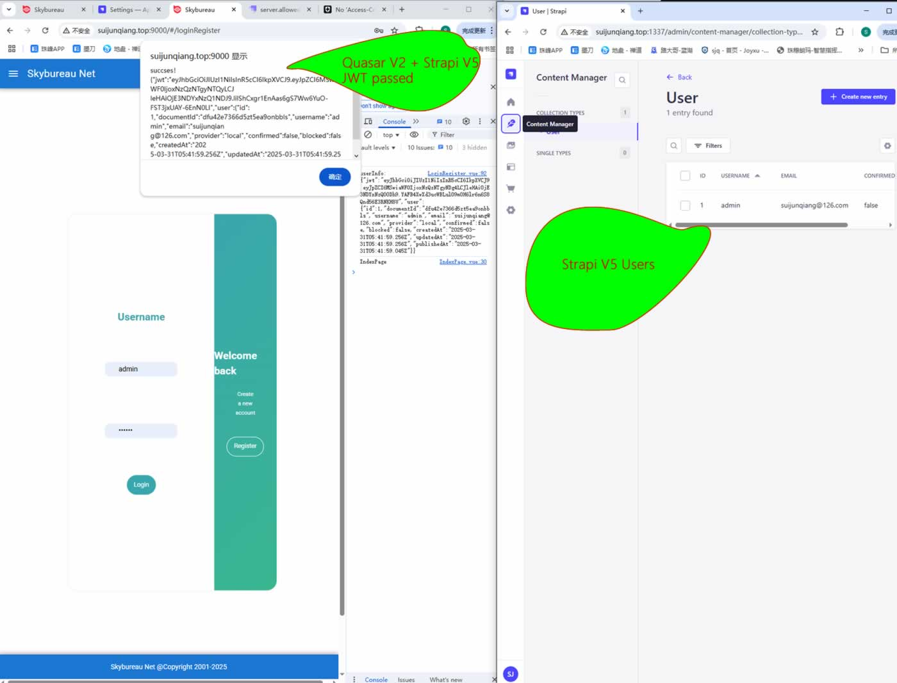

# Quasar App (quasar-skybureau)

Quasar Skybureau is based on Quasar V2.18.1 (Vue 3) (lastest) and Strapi V5.12.1
It is a full-stack application that allows you to create a website with a CMS, frontend and backend complemented by Quasar/Strapi/Mysql.
### APP download
android: http://www.skybureau.net:10000/sbn/sbn.apk
ios: http://www.skybureau.net:10000/sbn/sbn.apk
### Tech Stack Features
- [x] Quasar V2.18.5 (lastest)
- [x] Vue 3 (lastest)
- [x] Strapi V5.25.0 (lastest)
- [x] MySQL

### Features Done
- [x] Home/Product/Login/Language pages
- [x] Header/Footer/Content pages framework
- [x] Theme color customization for all pages
- [x] i18n support English/Simplified Chinese
- [x] JWT Authentication by Frontend/Strapi
- [x] Authorization module implementation
  - [x] User management module
  - [x] Menu management module edit/delete/add
  - [x] Branch management module edit/delete/add
  - [x] Position management module edit/delete/add
  - [x] Blog management module edit/delete/add Frontend/Backend
    - [x] Polish Blog comments management module edit/delete/add
    - [x] Polish Iot Devices management module edit/delete/add
- [x] Publish the test APK for Android
- [x] News management module Frontend/Backend edit/delete/add
- [x] Iot devices review module Frontend/Backend online/offline

### Features To Do
- [x] News management module for public access
- [x] WebRTC management module Frontend/Backend
- [x] Iot devices firmware update module Frontend/Backend
- [x] AI Agnet ask system for Skybureau Net
- [x] Publish the iOS for Iphone app

### Getting Started
How to start the project and run it locally.
[INSTALL](./readme/README_INSTALL.md)

### Demo online
- Frontend admin/111111 [Quasar Skybureau](http://www.skybureau.net:9000)
- Backend [Strapi Skybureau](http://www.skybureau.net:1337/admin)

### Screen Shot
- 
- 
- 

### License
MIT
